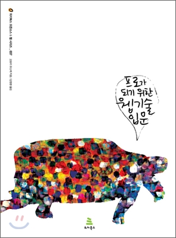

# 프로가 되기 위한 웹 기술 입문

## 구입 동기

구매하지 않고 도서관에서 대여했다. 현재 절판되었기 때문이다.  
[자바 웹 프로그래밍 Next Step](http://www.yes24.com/Product/Goods/31869154)에서 웹 기본서로 이 책을 추천했다. 특히 Cookie와 Session의 개념을 자세하게 설명하고 있다고 해서 읽어보았다.  

## 소감

과연 Cookie, Session에 대한 설명이 상세하다. 덕분에 해당 개념에 대한 이해도가 높아졌다. 

## 특히 좋았던 부분

www의 탄생부터 프레임워크까지 웹 프로그래밍 발전사를 훑어주는 부분이 좋았다. 이 기술에서 어떤 문제점이 있었고, 그것을 보완하기 위해 이 기술이 등장했다는 방식으로 설명을 이어가기 때문에 **왜** 이 기술이 현재 사용되지 않고, 사용되고 있는지 설명한다. 이 과정에서 본인이 공부하고 있는 웹 프로그래밍 기술에 대한 이해도가 더 높아졌다. 영화나 드라마 속의 주인공들의 사연을 알고 보면 더욱 재미있듯이, 프로그래밍 또한 그런 것 같다.